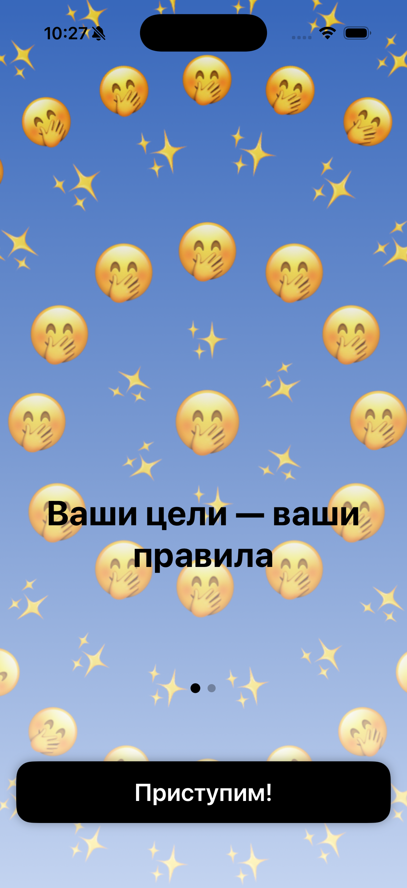
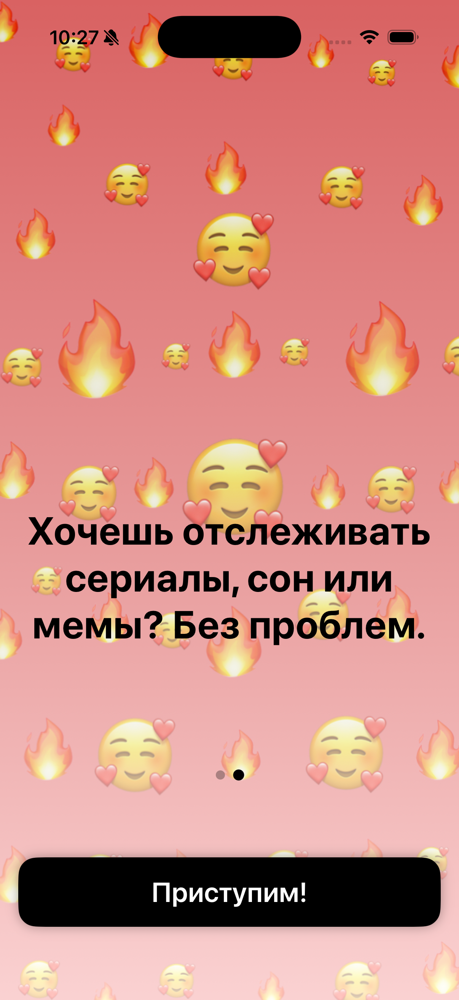
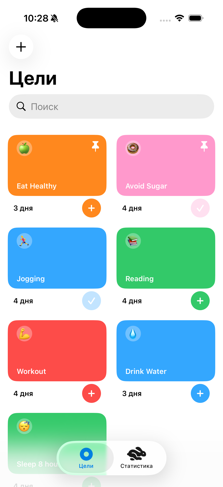
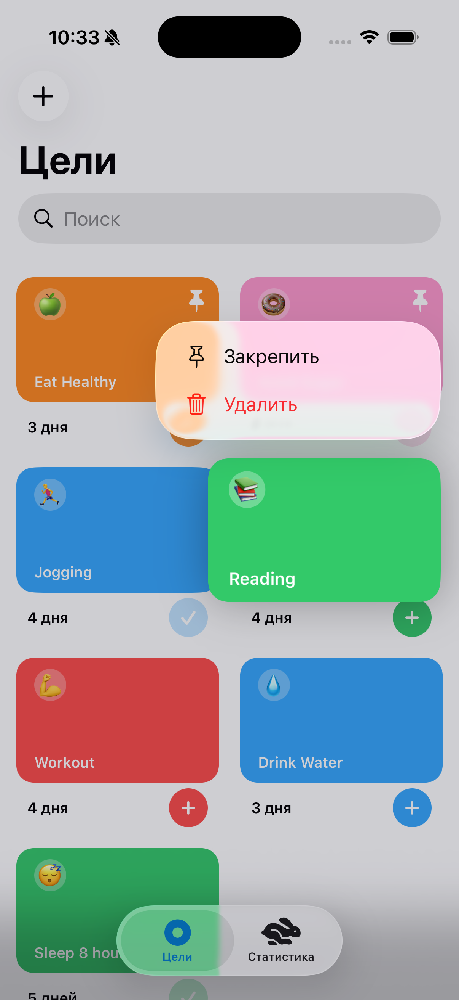
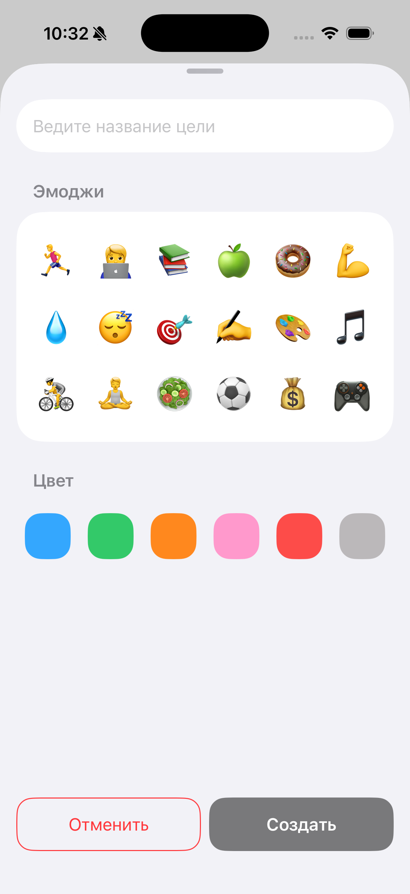
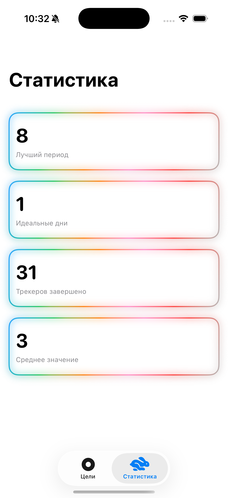
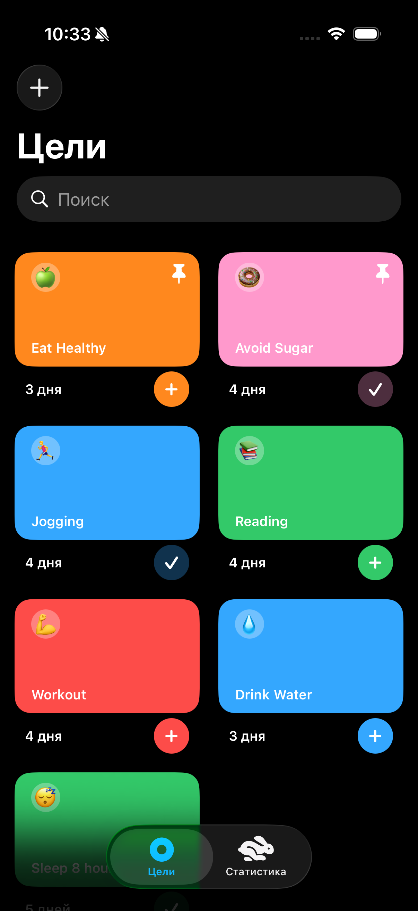
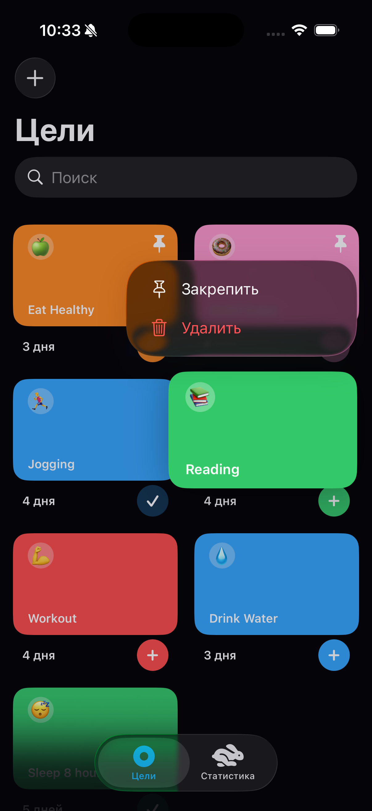
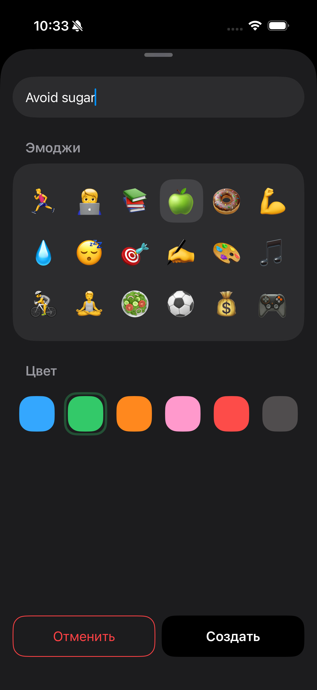
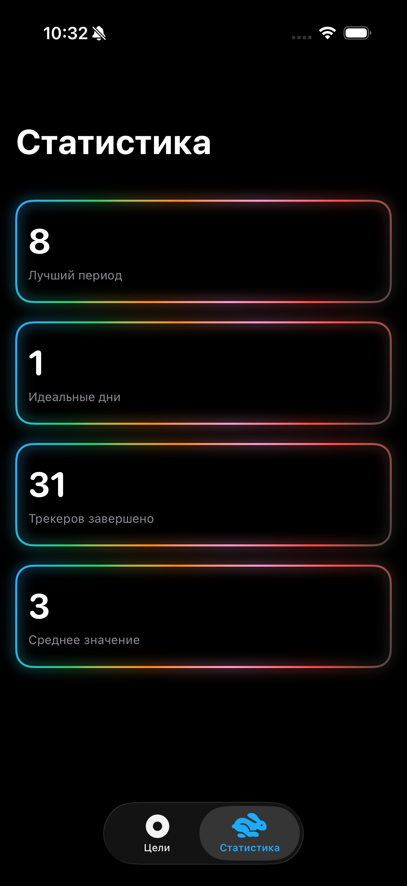

# GoalsTrackerApp

## Описание приложения

Приложение для отслеживания привычек и целей на гибких карточках-трекерах. Создавайте уникальные карточки с названием, цветом и эмодзи, закрепляйте важное вверху и следите за прогрессом с помощью наглядной статистики. Поддерживается локализация — интерфейс доступен на нескольких языках в зависимости от настроек устройства.

## Скриншоты и демо-видео

### Скриншоты

#### Onboarding

    
    

#### Light mode

    
    
    
    

#### Dark mode

    
    
    
    

### Демо-видео

  

## Технологический стек

- Swift 6 / Xcode 26
- SwiftUI (навигация, верстка, анимации)
- Combine (реактивные подписки и обновления)
- Concurrency (async/await при загрузке/обработке данных)
- CoreData + CloudKit (локальное хранилище и синхронизация)
- Foundation (базовые типы, дата/UUID, утилиты)
- Архитектура: MVVM (View + ViewModel + Model)

## Назначение и цели приложения

Приложение помогает пользователям формировать полезные привычки и контролировать их выполнение.

Цели приложения:

- Контроль целей по дням;
- Просмотр прогресса по целям;

## Функциональные требования

### Онбординг

При первом входе в приложение пользователь попадает на экран онбординга.

**Экран онбординга содержит:**
- Заставку
- Заголовок и вторичный текст
- Page controls
- Кнопку

**Алгоритмы и доступные действия:**
- С помощью кнопки пользователь может переключаться между страницами. При переключении страницы page controls меняет состояние.
- При нажатии кнропки на второй странице пользователь переходит на главный экран.

### Создание карточки привычки

На главном экране пользователь может создать цель. *Цель* — событие, которое повторяется каждый день.

#### Экран создания цели
- Заголовок экрана
- Поле для ввода названия цели
- Раздел с эмодзи
- Раздел с выбором цвета цели
- Кнопка «Отменить»
- Кнопка «Создать»

#### Алгоритмы и доступные действия
- **Ввод названия:**
  - После ввода одного символа появляется иконка крестика. При нажатии на иконку пользователь может удалить введенный текст.
  - Максимальное количество символов — 38.
- **Оформление:**
  - Пользователь может выбрать эмодзи. Под выбранным эмодзи появляется подложка.
  - Пользователь может выбрать цвет цели. На выбранном цвете появляется обводка.
- **Завершение создания:**
  - При нажатии кнопки «Отменить» пользователь может прекратить создание привычки.
  - Кнопка «Создать» неактивна, пока не заполнены все разделы. При нажатии на кнопку открывается главный экран.

### Просмотр главного экрана

На главном экране пользователь может просмотреть все созданные цели, закрепить/удалить их и посмотреть статистику.

**Главный экран содержит:**
- Кнопку «+» для добавления цели
- Заголовок «Цели»
- Поле для поиска целей
- Таб-бар

#### Алгоритмы и доступные действия
- **Навигация и дата:**
  - При нажатии на «+» всплывает шторка с возможностью создать цель.
- **Поиск:**
  - Пользователь может искать цели по названию в окне поиска. Если ничего не найдено, отображается заглушка.
- **Взаимодействие с карточками:**
  - При скролле вниз и вверх пользователь может просматривать ленту.
  - Если изображение карточки не успело загрузиться, отображается системный лоадер.
  - При нажатии на карточку фон под ней затемняется и всплывает модальное окно.
  - **Закрепление:** Пользователь может закрепить карточку.
  - **Удаление:** При нажатии на «Удалить» удаляется цель и все записи о ней
- **Таб-бар:** С помощью таб-бара пользователь может переключаться между разделами «Цели» и «Статистика».

### Просмотр статистики

Во вкладке статистики пользователь может посмотреть успешные показатели, свой прогресс и средние значения.

**Экран статистики содержит:**
- Заголовок «Статистика»
- Список со статистическими показателями. **Каждый показатель содержит:**
  - Заголовок-цифру
  - Вторичный текст с названием показателя
- Таб-бар

#### Алгоритмы и доступные действия
- Если данных нет ни по одному показателю, пользователь видит заглушку.
- Если есть данные хотя бы по одному показателю, статистика отображается. Показатели без данных отображаются с нулевым значением.
- **Список показателей:**
  - **«Лучший период»** — максимальное количество дней без перерыва по всем целям.
  - **«Идеальные дни»** — дни, когда были выполнены все запланированные привычки.
  - **«Целей завершено»** — общее количество выполненных привычек за все время.
  - **«Среднее значение»** — среднее количество привычек, выполненных за 1 день.

### Темная тема

В приложении есть темная тема, которая меняется в зависимости от настроек системы устройства.
